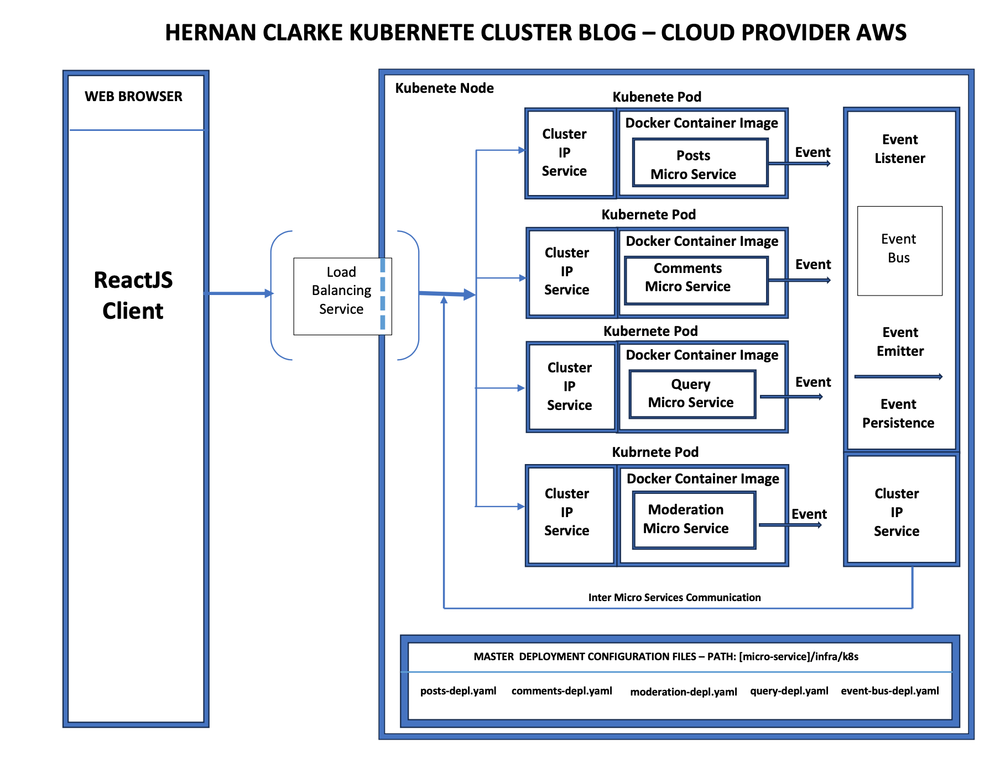

HC blog is an application made with a collection of microservices, completely independent. The app uses a simplistic event driven bus with just enough functionality to listen and broadcast events so that each independent micro-service.

For deployment, each micro service is deployed in its own docker image and then into a kubernetes pod for orchestration.

We use infrastructure as code as described in the k8s yaml files under the infra /k8s folder